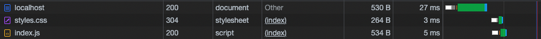

Take a look at the inspect window (Network + Sources tab) to see what is served

Now we want to separate `html`, `css` and `javascript` codes to different files.

Use

```
app.use(express.static(folder_containing_your_static_files));
```

Check the `Network` and `Sources` tab again

